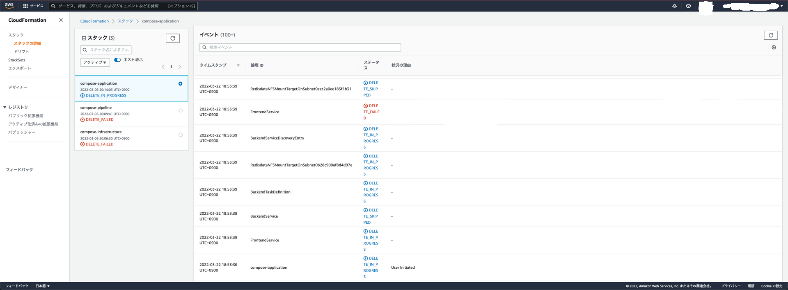
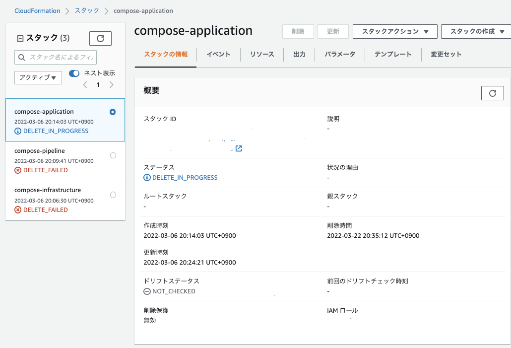
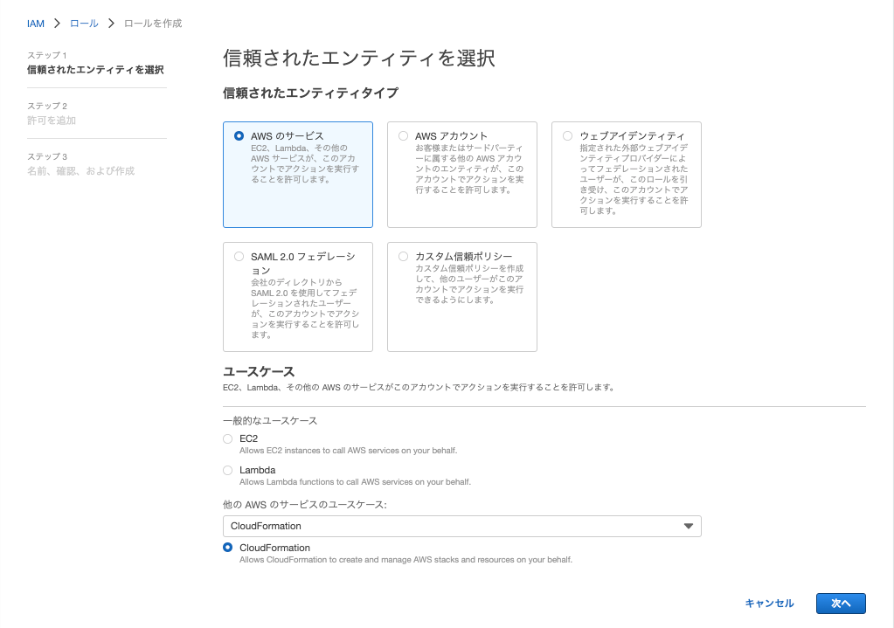
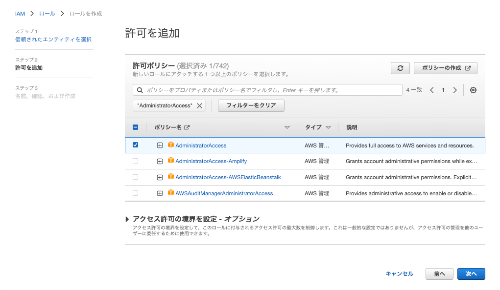
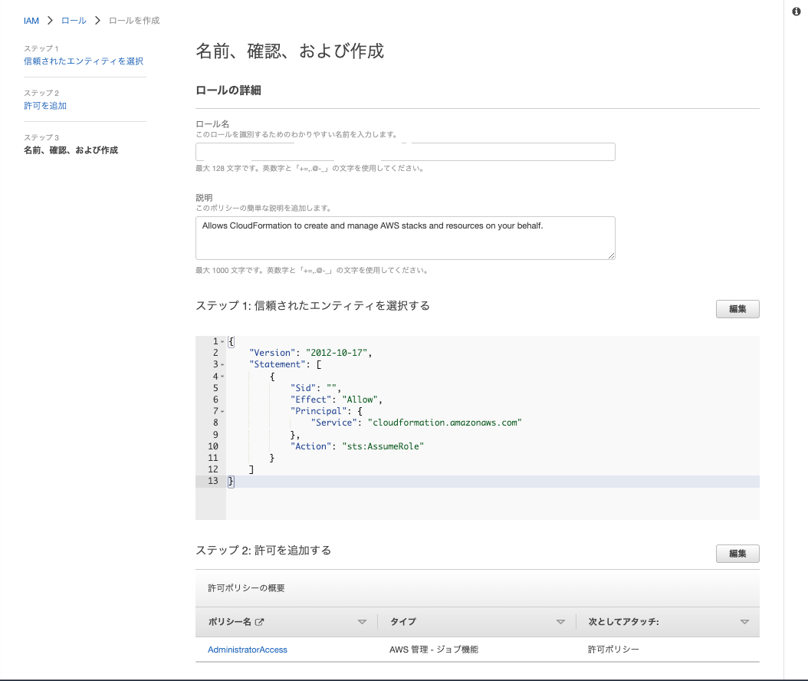

# Docker ComposeとAmazon ECSのチュートリアル実行
## 実行したチュートリアル

[https://aws.amazon.com/jp/blogs/news/automated-software-delivery-using-docker-compose-and-amazon-ecs/](https://aws.amazon.com/jp/blogs/news/automated-software-delivery-using-docker-compose-and-amazon-ecs/)

**※ ap-northeast-2 で作業してください！**

## 事前準備

- aws コマンドのインストール
    - [https://docs.aws.amazon.com/ja_jp/cli/latest/userguide/getting-started-install.html](https://docs.aws.amazon.com/ja_jp/cli/latest/userguide/getting-started-install.html)
    - version 2 をインストールして検証したので、version 1 では未検証
- 以下のいずれかの条件を満たす IAM ユーザのアクセスキーIDとシークレットアクセスキー
    - OpenIDConnectProviderForGitHubActionsRole が持っている許可ポリシーと同等な権限をもつIAMユーザ
        - (以下は 2022/03/06 現在の設定内容で今後見直される可能性がある)
        - DeployingDockerContainersOnECS
        - IAMManagePolicy
        - IAMPassRoleAccess
        - ReadAndWriteS3Bucket
        - AmazonEC2FullAccess
        - AmazonS3FullAccess
        - AWSCloudFormationFullAccess
        - ManageCodeBuild
            - インラインポリシーです...
            - CodeBuild のアクセス権限の管理以外を許可したポリシー
        - ManageElasticContainerRegistry
            - これもインラインポリシーです...
            - ECR のアクセス権限の管理以外を許可したポリシー
    - Deploy と Develop グループに入っている IAM ユーザ
        - 駄目だったら以下のポリシーを追加して試してみてください...
        - AmazonElasticFileSystemFullAccess
        - AmazonElasticFileSystemClientReadWriteAccess
        - AmazonElasticFileSystemClientReadOnlyAccess
- 以下のコマンドからプロファイルの設定

CLIの導入は[aws cliの導入](./install-aws-cli.md) を参考にしてください

```bash
$ aws configure --profile 任意のプロファイル名
# アクセスキーとシークレットキーと region を聞かれるので `ap-northeast-2`を入力
```

## 再現手順

チュートリアルの通りにやれば良いのだが、注意点がいくつかある

チュートリアルに書いてないことは**赤字**で示す

以下に書いてあるとおりサンプルの設定が一部間違っているが後に正しく修正されるかもしれないが、[このバージョン](https://github.com/aws-containers/demo-app-for-docker-compose/tree/875c45f3beff5dee23a0de49c0f28ffab94c3684)で確認した

## [localhost](http://localhost) での実行

```bash
$ git clone https://github.com/aws-containers/demo-app-for-docker-compose.git
$ cd demo-app-for-docker-compose/application
$ docker compose up
```

[localhost:80](http://localhost:80) で確認できる

## インフラの作成

**infrastructure/cloudformation.yaml の変更**

以下の DependsOn の行の追加（Role の作成前に実行すると失敗するので）

```yaml
# ECS Resources
  ECSCluster:
    Type: AWS::ECS::Cluster
    DependsOn: ECSTaskExecutionRole
```

CloudFormation の Stack 作成

```bash
$ cd ../infrastructure
$ aws cloudformation create-stack \
    --stack-name compose-infrastructure \
    --template-body file://cloudformation.yaml \
    --capabilities CAPABILITY_IAM
```

AWS Console から CloudFormation の Stack が正常にデプロイされたことを確認できたら以下で環境変数を設定

```bash
$ VPC_ID=$(aws cloudformation describe-stacks --stack-name compose-infrastructure --query "Stacks[0].Outputs[?OutputKey=='VpcId'].OutputValue" --output text)
$ ECS_CLUSTER=$(aws cloudformation describe-stacks --stack-name compose-infrastructure --query "Stacks[0].Outputs[?OutputKey=='ClusterName'].OutputValue" --output text)
$ LOADBALANCER_ARN=$(aws cloudformation describe-stacks --stack-name compose-infrastructure --query "Stacks[0].Outputs[?OutputKey=='LoadbalancerId'].OutputValue" --output text)
```

## AWS CodePipeline の作成

**pipeline/cloudformation.yaml の変更**

以下の Action を追加（**既にある Action は消さない**）

```yaml
ComposeRolePolicy:
    Type: AWS::IAM::Policy
    Properties:
      PolicyName: ComposeRolePolicy
      Roles:
        - Ref: ExtractBuildRole
      PolicyDocument:
        Version: "2012-10-17"
        Statement:
          - Action:
            - ec2:CreateNetworkInterface
            - ec2:DeleteNetworkInterface
            - elasticfilesystem:UpdateFileSystem
            - iam:TagRole
            - iam:UntagRole
            - iam:GetRolePolicy
```

ただし、Action の `elasticfilesystem:ModifyMountTarget` は削除して良い（存在しないので）

CloudFormation の Stack 作成

```bash
$ cd ../pipeline/
$ aws cloudformation create-stack \
     --stack-name compose-pipeline \
     --template-body file://cloudformation.yaml \
     --capabilities CAPABILITY_IAM \
     --parameters \
     ParameterKey=ExistingAwsVpc,ParameterValue=$VPC_ID \
     ParameterKey=ExistingEcsCluster,ParameterValue=$ECS_CLUSTER \
     ParameterKey=ExistingLoadbalancer,ParameterValue=$LOADBALANCER_ARN
```

正常にデプロイされると CodePipeline が作成、実行されるが失敗するが問題ない

## アプリケーションデプロイ

```bash
$ cd ../application
$ BUCKET_NAME=$(aws cloudformation describe-stacks --stack-name compose-pipeline --query "Stacks[0].Outputs[?OutputKey=='S3BucketName'].OutputValue" --output text)
$ zip -r compose-bundle.zip .
$ aws s3 cp compose-bundle.zip s3://$BUCKET_NAME/compose-bundle.zip
```

CodePipeline からデプロイ状況が確認できる。

**手動で承認するプロセスを挟んでいるため、承認する必要がある。**

ELBのエンドポイントは以下で確認でき、デプロイが終わったらアプリが見える

```bash
$ aws cloudformation describe-stacks --stack-name compose-infrastructure --query "Stacks[0].Outputs[?OutputKey=='LoadbalancerEndpoint'].OutputValue" --output text
```

## サンプルアプリケーションの更新

アプリケーションの修正をして再度 S3 にアップロードするだけ

Mac ユーザか Linux ユーザかで sed のコマンドが違うのだけ注意

```bash
$ cd ../application/

# Replace the word "Blue" with "Green" in the frontend application.# For Linux Users:
$ sed -i 's/blue/green/g' frontend/myweb/app.py

# For Mac OS users:
$ sed -i "" 's/blue/green/g' frontend/myweb/app.py
```

再度ビルドして [localhost](http://localhost) で確認する

```bash
$ docker compose down
$ docker rmi frontend:latest
$ docker compose up --build
```

再度アップロードし、CodePipeline から承認後、色が変わることを確認

```bash
$ zip -r compose-bundle.zip .
$ aws s3 cp compose-bundle.zip s3://$BUCKET_NAME/compose-bundle.zip
```

## 後片付け

ここは現状失敗しているので、後々手作業で削除している...

`aws cloudformation delete-stack --stack-name compose-application`

`aws cloudformation delete-stack --stack-name compose-infrastructure`

の2つのコマンドで Stack を削除しているが、CloudFormation のログを見ると削除に失敗していた

CloudFormation で compose-application の削除を確認してからS3 オブジェクトの削除などをやった方がいいかもしれないが、~~未検証~~

**追記: compose-application の削除の完了を確認してからやれば成功する**

```bash
# Delete the Sample Application deployed via the Pipeline
$ aws cloudformation delete-stack --stack-name compose-application
# !!!!!!!以下でちゃんとリソースが削除されたことを確認してから次のコマンドを実行する！！！！！！！！！！
$ aws cloudformation describe-stacks --stack-name compose-application
```

```bash
# Delete the S3 Objects
$ BUCKET_NAME=$(aws cloudformation describe-stacks --stack-name compose-pipeline --query "Stacks[0].Outputs[?OutputKey=='S3BucketName'].OutputValue" --output text)
$ aws s3api delete-objects \
  --bucket $BUCKET_NAME --delete \
  "$(aws s3api list-object-versions \
    --bucket "${BUCKET_NAME}" \
    --output=json \
    --query='{Objects: Versions[].{Key:Key,VersionId:VersionId}}')"

# Delete the S3 Bucket
$ aws s3 rb s3://$BUCKET_NAME

# Delete the ECR Repository
$ ECR_REPO=$(aws cloudformation describe-stacks --stack-name compose-pipeline --query "Stacks[0].Outputs[?OutputKey=='DemoAppEcrName'].OutputValue" --output text)
$ aws ecr delete-repository --repository-name $ECR_REPO --force

# Delete the Sample Pipeline
$ aws cloudformation delete-stack --stack-name compose-pipeline

# Delete the Networking and ECS Infrastructure
$ aws cloudformation delete-stack --stack-name compose-infrastructure
```

- 後片付け 3-party

    ```bash
    $ aws cloudformation delete-stack --stack-name compose-application0
    $ aws cloudformation delete-stack --stack-name compose-application1
    $ aws cloudformation delete-stack --stack-name compose-application2

    # Delete the S3 Objects
    $ BUCKET_NAME=$(aws cloudformation describe-stacks --stack-name compose-pipeline0 --query "Stacks[0].Outputs[?OutputKey=='S3BucketName'].OutputValue" --output text)
    $ aws s3api delete-objects \
      --bucket $BUCKET_NAME --delete \
      "$(aws s3api list-object-versions \
        --bucket "${BUCKET_NAME}" \
        --output=json \
        --query='{Objects: Versions[].{Key:Key,VersionId:VersionId}}')"
    # Delete the S3 Bucket
    $ aws s3 rb s3://$BUCKET_NAME

    # Delete the S3 Objects
    $ BUCKET_NAME=$(aws cloudformation describe-stacks --stack-name compose-pipeline1 --query "Stacks[0].Outputs[?OutputKey=='S3BucketName'].OutputValue" --output text)
    $ aws s3api delete-objects \
      --bucket $BUCKET_NAME --delete \
      "$(aws s3api list-object-versions \
        --bucket "${BUCKET_NAME}" \
        --output=json \
        --query='{Objects: Versions[].{Key:Key,VersionId:VersionId}}')"
    # Delete the S3 Bucket
    $ aws s3 rb s3://$BUCKET_NAME

    # Delete the S3 Objects
    $ BUCKET_NAME=$(aws cloudformation describe-stacks --stack-name compose-pipeline2 --query "Stacks[0].Outputs[?OutputKey=='S3BucketName'].OutputValue" --output text)
    $ aws s3api delete-objects \
      --bucket $BUCKET_NAME --delete \
      "$(aws s3api list-object-versions \
        --bucket "${BUCKET_NAME}" \
        --output=json \
        --query='{Objects: Versions[].{Key:Key,VersionId:VersionId}}')"
    # Delete the S3 Bucket
    $ aws s3 rb s3://$BUCKET_NAME

    # Delete the ECR Repository
    $ ECR_REPO=$(aws cloudformation describe-stacks --stack-name compose-pipeline0 --query "Stacks[0].Outputs[?OutputKey=='DemoAppEcrName'].OutputValue" --output text)
    $ aws ecr delete-repository --repository-name $ECR_REPO --force

    # Delete the ECR Repository
    $ ECR_REPO=$(aws cloudformation describe-stacks --stack-name compose-pipeline1 --query "Stacks[0].Outputs[?OutputKey=='DemoAppEcrName'].OutputValue" --output text)
    $ aws ecr delete-repository --repository-name $ECR_REPO --force

    # Delete the ECR Repository
    $ ECR_REPO=$(aws cloudformation describe-stacks --stack-name compose-pipeline2 --query "Stacks[0].Outputs[?OutputKey=='DemoAppEcrName'].OutputValue" --output text)
    $ aws ecr delete-repository --repository-name $ECR_REPO --force

    # Delete the Sample Pipeline
    $ aws cloudformation delete-stack --stack-name compose-pipeline0
    $ aws cloudformation delete-stack --stack-name compose-pipeline1
    $ aws cloudformation delete-stack --stack-name compose-pipeline2

    # Delete the Networking and ECS Infrastructure
    $ aws cloudformation delete-stack --stack-name compose-infrastructure0
    $ aws cloudformation delete-stack --stack-name compose-infrastructure1
    $ aws cloudformation delete-stack --stack-name compose-infrastructure2
    ```


# トラブルシューティング

### Q. compose-applicationの削除でDELETE_FAILEDが発生する



A.

前のステップのDELETE完了を確認してから次のリソース削除を開始するべし。

もうやってしまった場合は以下

以下のようにスタックの情報からIAMロールを探して `arn:aws...` の部分をコピー



IAM > ロール > ロールを作成する


ユースケースでCloudFormationを選択する



許可を追加で `AdministratorAccess` を選択して `次へ`



ロール名に先ほどコピーした `arn:aws:iam::hoge:role/{role-name}` の `{role-name}` をペーストして `ロールを作成`



CloudFormationに戻って、DELETE_FAILEDしたスタックを削除する

削除が完了したら作成したロールを削除する。
