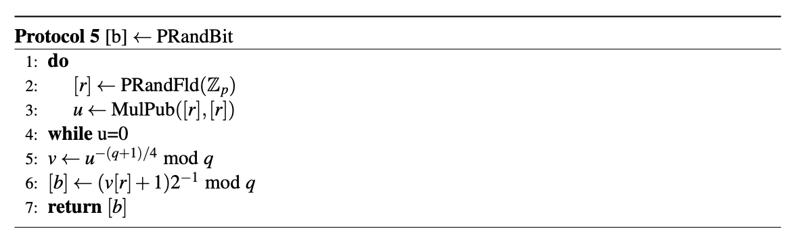
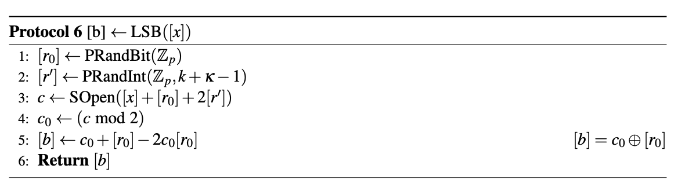
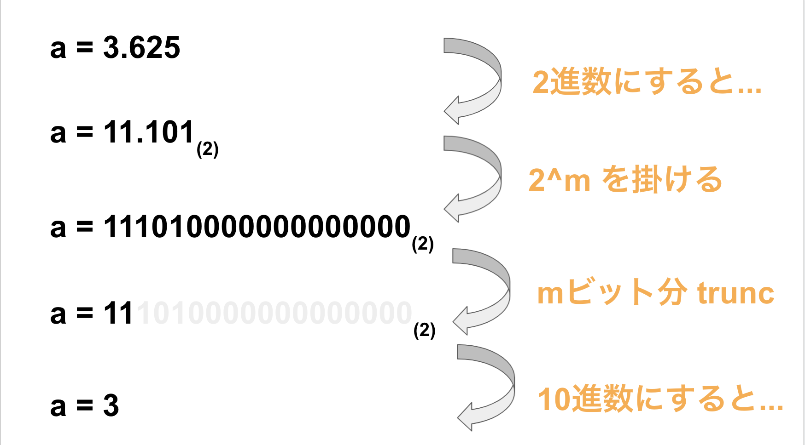
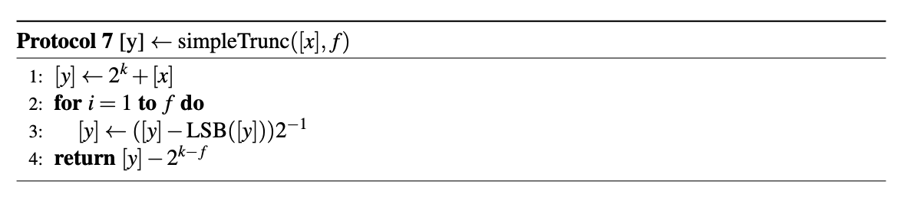
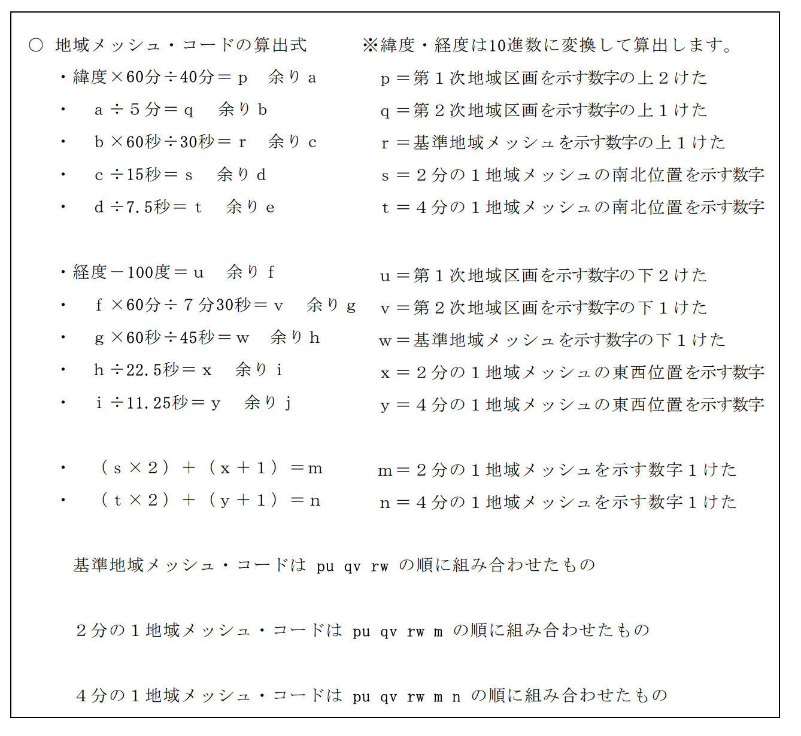

# MeshCode 変換プロトコル

## 各種プロトコルの説明

---

### 乱数ビットシェア生成プロトコル (getRandBitShare)

- 乱数ビットシェア $[b] \ (b \in \{0,1 \})$  を生成する。
    - 入力: なし
    - 出力: $[b]$
- アルゴリズムは以下を参照のこと。

    

- 上記は素体ベースのプロトコル。
    - 実数体でもほぼ同じプロトコルになる。
        - L.5 は平方剰余の逆元を求めている。実数体では、以下のように書き換えられる。
            - $v \leftarrow 1/\sqrt{u} \ (= 1/\sqrt{r^2})$
        - 実数体の場合、$r > 0$ ならば $b=1$, $r < 0$ ならば $b = 0$ となる。

### LSB シェア取得プロトコル (getLSBShare)

- 正の整数 $x$ の最下位ビットシェアを取得する。
    - 入力: $[x]$
    - 出力: $[LSB(x)]$
- アルゴリズムは以下を参照のこと。

    

- 上記は素体ベースのプロトコル
    - 実数体でもほぼ同じプロトコルになる。
        - 一点注意点なのは、$c \geq 0$ かつ整数である必要がある。
            - $c < 0$ の場合、$c_0 \in \{ 0, -1 \}$ となり、XOR の結果が正しくなくなる。

### 床関数プロトコル (getFloor)

- 実数 $y$ の整数部分のシェアを取得する。
    - 入力: $[y]$
    - 出力: $[Floor(y)]$
- 床関数プロトコルのイメージ

    

- trunc のアルゴリズム (f は m に読み替えてください)

    

### MeshCode 変換プロトコル

getFloor と四則演算を用いることで、MeshCode 変換が可能。

現在は、4分の1地域メッシュ・コードを生成。

## その他

---

## 参考文献

---

[https://pure.tue.nl/ws/portalfiles/portal/109478717/0746865_IAM_Master_Thesis_Harm_Campmans.pdf](https://pure.tue.nl/ws/portalfiles/portal/109478717/0746865_IAM_Master_Thesis_Harm_Campmans.pdf)

## コメント
