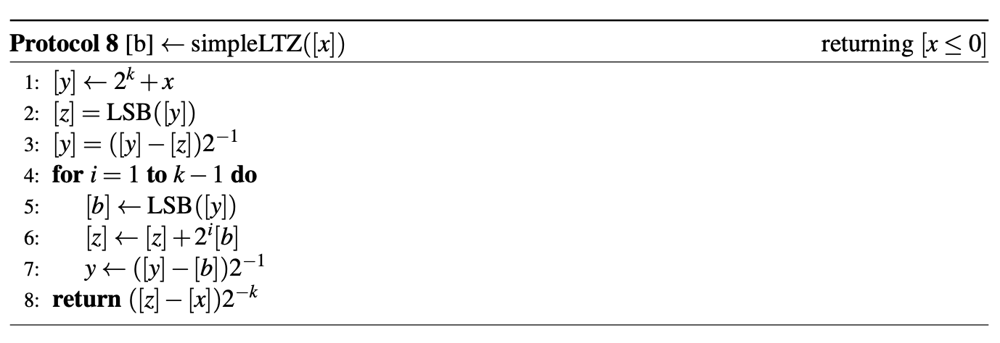

# 背景

- PrimeField を利用した比較演算は、各 Party 間の通信が頻繁に発生するため実行速度が遅い。
    - 現状使用しているプロトコル: [https://blog.acompany.tech/9d97e2dcb7b244b3badbb3cc1a6a3698](https://blog.acompany.tech/9d97e2dcb7b244b3badbb3cc1a6a3698)
- なるべく通信回数を減らして、効率的に比較演算を実行させたい。

# 前提知識

- $[a < b]$ の値について
    - $a < b$ が true である場合は、recons した結果は 1
    - $a < b$ が false である場合は、recons した結果は 0
    - その他の比較演算も同様の考え方 (true なら 1、false なら 0)
    - 上記の考え方より、$[a \geq b] = [1 -  (a < b)]$ である

# 提案

- 下記論文に掲載されているアルゴリズム (simpleLTZ) を採用したい。
    - [https://pure.tue.nl/ws/portalfiles/portal/109478717/0746865_IAM_Master_Thesis_Harm_Campmans.pdf](https://pure.tue.nl/ws/portalfiles/portal/109478717/0746865_IAM_Master_Thesis_Harm_Campmans.pdf)
    - **注意: 下記画像右上の $[x \leq 0]$ は、正しくは $[x < 0]$ である。**
- simpleLTZ は、PrimeField に変換せず実数体ベースで比較を実行する。
- 2, 5行目で使用されている LSB (最下位ビット取得) のアルゴリズムは、以下を参照。
    - [MeshCode 変換プロトコル](./meshcode-conversion-protocol.md)



**前提条件**

- $2^k > |x|$ である。
    - 現状は、$k=32$ としている。
        - $2^{32} = 4294967296$ より、十分な大きさであるため、一旦 $k=32$ としている。
        - $k$ は変更可能。

**アルゴリズムの簡単な説明**

肝は $z$  の値。$z$ は、最終的に $y$ の最上位ビットを取り除いた値になる。

- $x \geq 0$ の場合
    - $z = x$ より、8行目の値を recons すると 0 (すなわち false)
- $x < 0$ の場合
    - $z = (2^k+x)$ より、8行目の値を recons すると 1 (すなわち true)

**simpleLTZ だけで全ての比較演算を実装することができる**

- $[a < b]$ は、$LTZ([a-b])$ と同値である。
- $[a < b]$  と $[a = b]$ が実装できれば、その他の比較演算も全て実装可能となる。
- $[a=b]$ も、$[a < b]$ を用いて以下のロジックにより計算可能。

$$
\begin{align*}
([a=b]) &= ([a \leq b] \cdot [a \geq b]) \\
&= ([1 - (b < a)] \cdot [1 - (a < b)])
\end{align*}
$$

# 既存の比較演算との比較

|                    | PrimeField を用いた方式                                                             | 提案方式                                                                      |
| ------------------ | ----------------------------------------------------------------------------------- | ----------------------------------------------------------------------------- |
| 実行速度           | x (遅い)                                                                            | ◎ (10倍程度高速になる)                                                        |
| 比較可能な範囲     | ◎ (p 未満の値であれば比較可能)                                                      | ◯ (k=32 でも、十分な比較可能範囲を確保できる)                                 |
| 誤判定の確率の低さ | ◎ (プロトコルに従えば誤判定の確率は0)                                               | ◎ (誤判定の確率は厳密には0ではないが、現状テストによる誤判定は検知していない) |
| 安全性             | ◎ (PrimeField はオーバフロの懸念がないため、素体空間全体を乱数範囲とすることが可能) | ◯ (比較以外の演算のセキュリティレベルと同程度)                                |
- PrimeField を用いた方式より、提案方式で比較演算を実装することを薦めたい。
    - ネックであった実行速度の問題を解決できる (10倍程度高速になる)。
    - 比較可能な範囲は、$2^k > |a-b|$ であり、$k=32$ 程度でも十分な範囲である。
        - また、$k$ は変更可能である。
    - 誤判定の確率は厳密には 0 ではないが、現状テストによる誤判定は検知していない。
        - 1000回 RandomComparisonTest を回したが、1度も誤判定していない。
    - 安全性は PrimeField を用いた方式より劣るが (乱数空間が PrimeField より狭いため)、比較以外の演算のセキュリティレベルと同程度である。

# 計算速度の計測

```jsx
computation_container2 | [Share < Share] took 142 ms
computation_container1 | [Share < Share] took 142 ms
computation_container3 | [Share < Share] took 140 ms
computation_container1 | [Share < Share] took 127 ms
computation_container3 | [Share < Share] took 128 ms
computation_container2 | [Share < Share] took 127 ms
computation_container1 | [Share < Share] took 115 ms
computation_container3 | [Share < Share] took 115 ms
computation_container2 | [Share < Share] took 117 ms
computation_container1 | [Share < Share] took 120 ms
computation_container2 | [Share < Share] took 119 ms
computation_container3 | [Share < Share] took 120 ms
computation_container1 | [Share == Share] took 223 ms
computation_container2 | [Share == Share] took 223 ms
computation_container3 | [Share == Share] took 224 ms
computation_container1 | [Share == Share] took 276 ms
computation_container3 | [Share == Share] took 275 ms
computation_container2 | [Share == Share] took 277 ms

computation_container3 | getLSBShare took 2 ms
computation_container3 | getLSBShare took 3 ms
computation_container1 | getLSBShare took 4 ms
computation_container2 | getLSBShare took 4 ms
computation_container1 | getLSBShare took 3 ms
computation_container3 | getLSBShare took 3 ms
computation_container2 | getLSBShare took 3 ms
computation_container1 | getLSBShare took 3 ms
computation_container3 | getLSBShare took 3 ms
computation_container2 | getLSBShare took 4 ms
computation_container2 | getLSBShare took 2 ms
```
