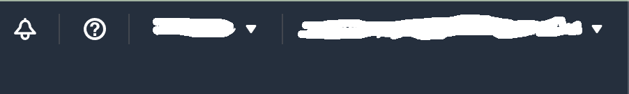
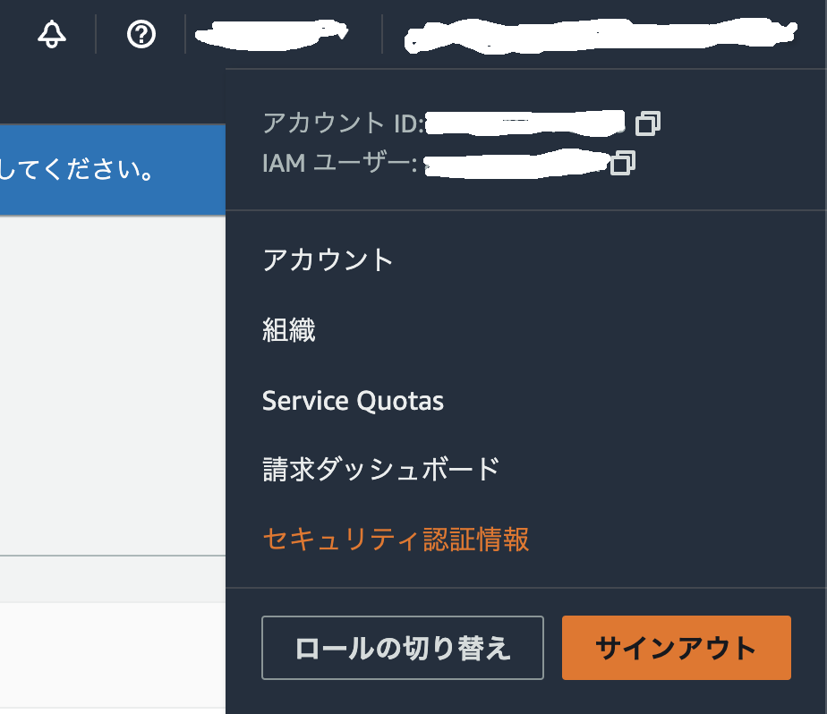
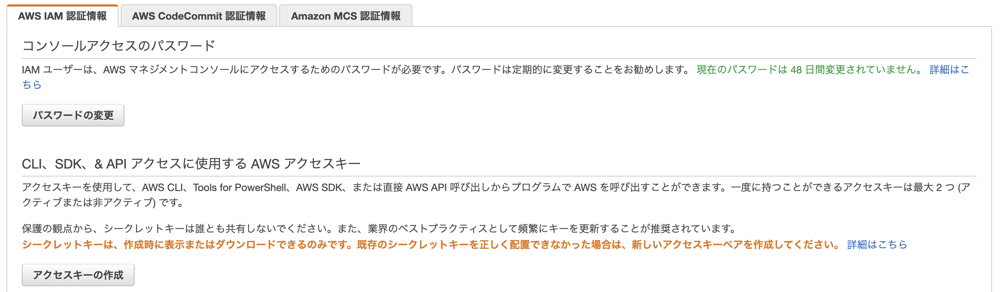

# aws cliの導入

## CLIのインストール

1. aws cliをinstallする

    ```makefile
    curl "https://awscli.amazonaws.com/awscli-exe-linux-x86_64.zip" -o "awscliv2.zip"
    unzip awscliv2.zip
    sudo ./aws/install
    rm -rf ./awscliv2.zip ./aws
    ```

2. awsのcredentialを作成する
    1. awsのコンソールにsign inして右上のトグルを開く

        

    2. セキュリティ認証情報を押す

        

    3. アクセスキーを作成して認証情報のcsvをダウンロードする

        

    4. aws configureコマンドでcredentialファイルを作成する

        ```bash
        $ aws configure
        AWS Access Key ID [None]: <ここにCSVに書いてあるAccess key IDをコピペ>
        AWS Secret Access Key [None]: <ここにCSVに書いてあるSecret access keyをコピペ>
        Default region name [None]: ap-northeast-1
        Default output format [None]:

        ```

        念の為確認

        ```bash
        $ cat ~/.aws/credentials # 確認
        [default]
        aws_access_key_id = ... # 先ほど入力したAccess key IDになっているはず
        aws_secret_access_key = ... # 先ほど入力したSecret access keyになっているはず
        ```


## Profile(プロファイル)の確認

```bash
$ cat ~/.aws/config
[default]
region = ap-northeast-1
output = text

$ aws ... --profile default # [default]の設定が使用される
```

## (Optional) Profile(プロファイル)の追加

```bash
$ aws configure --profile sample
AWS Access Key ID [None]: XXXXXXXXXXXXXXXX
AWS Secret Access Key [None]: XXXXXXXXXXXXXXXX
Default region name [None]: ap-northeast-2
Default output format [None]: json

$ cat ~/.aws/config
[default]
region = ap-northeast-1
output = text

[sample]
region = ap-northeast-2
output = json

$ aws ... --profile sample # [sample]の設定が使用される
```
